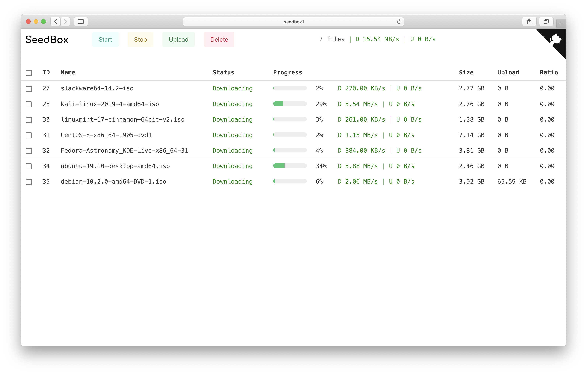
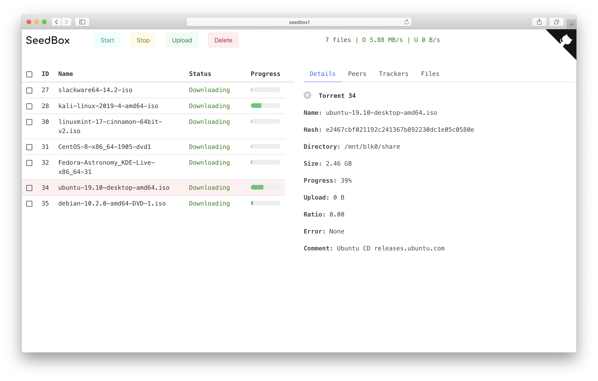

# Introduction

TRUI is a Web UI designed for [Transmission](https://github.com/transmission/transmission), with newer and nicer look.

# Features

- [x] Start, stop, upload and delete torrents
- [x] Mobile friendly UI
- [x] Pure html, css, js (easy to deploy and use)
- [ ] More setting options provided by original web interface

# Demo





# Installation

1. We provide a [Dockerfile](https://github.com/noobly314/trui/blob/master/docker/Dockerfile), for running configured Nginx service. Please make sure port 80 is not occupied before running container.

Build:

```
docker build . -t "trui:latest"
```

Run:

```
docker run  -d \
	--network="host" \
	--restart always \
	--name trui \
	trui:latest
```

2. You can also download latest [release](https://github.com/noobly314/trui/releases/latest) and extract it into the directory where you will serve static files. Serve trui static files with Nginx, Apache or whatever you like. Setup reverse proxy for transmission-daemon rpc service.

<details>
<summary>Nginx Configuration Example (click to open)</summary>

```
server {
        listen 80;
        server_name trui;
        # This can be either public or private IP/domain

        index index.html;
        root /var/www/trui;
        # This is where you put html, css, js files.

        location / {
                try_files $uri $uri/ /index.html;
        }

        location /transmission/rpc {
                proxy_pass          http://localhost:9091;
                proxy_redirect      off;
                proxy_set_header    Host            $host;
                proxy_set_header    X-Real-IP       $remote_addr;
                proxy_set_header    X-Forwarded-For $proxy_add_x_forwarded_for;
        }
        # You need to setup reverse proxy for transmission rpc

}

```

</details>

# License

See the [LICENSE](https://github.com/noobly314/trui/blob/master/LICENSE.md) file for license rights and limitations (MIT).
